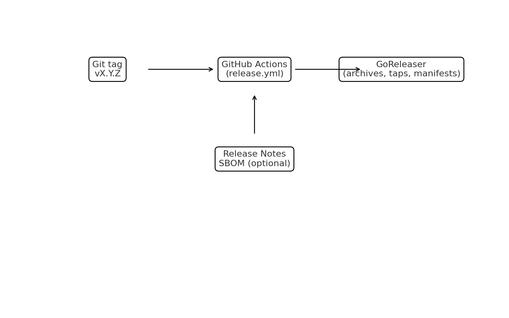

# CI & Release (GoReleaser + GitHub Actions)

## Why this matters
Automated releases in this repo currently:
- produce binaries for macOS/Linux/Windows
- produce Linux `.deb` and `.rpm` packages
- publish GitHub release artifacts and checksums through GoReleaser
- publish a Linux APT/RPM repository to GitHub Pages when the package repo and signing secrets are configured
- embed version metadata into the CLI binary
- publish a Homebrew cask when the tap repo token is configured
- generate and publish WinGet manifests when the fork token is configured

## Current GitHub Actions release flow
`.github/workflows/release.yml` (tag-triggered only):
```yaml
name: Release
on:
  push:
    tags: ["v*.*.*"]

jobs:
  goreleaser:
    runs-on: ubuntu-latest
    steps:
      - uses: actions/checkout@v4
        with:
          fetch-depth: 0
      - uses: actions/setup-go@v5
        with:
          go-version: "1.24.x"
      - run: go test ./...
      - run: go vet ./...
      - uses: goreleaser/goreleaser-action@v6
        with: { version: "~> v2", args: release --clean }
        env:
          GITHUB_TOKEN: ${{ secrets.GITHUB_TOKEN }}
          HOMEBREW_TAP_GITHUB_TOKEN: ${{ secrets.HOMEBREW_TAP_GITHUB_TOKEN }}
          WINGET_GITHUB_TOKEN: ${{ secrets.WINGET_GITHUB_TOKEN }}
          LINUX_PACKAGES_GITHUB_TOKEN: ${{ secrets.LINUX_PACKAGES_GITHUB_TOKEN }}
          LINUX_REPO_GPG_PRIVATE_KEY: ${{ secrets.LINUX_REPO_GPG_PRIVATE_KEY }}
          LINUX_REPO_GPG_PASSPHRASE: ${{ secrets.LINUX_REPO_GPG_PASSPHRASE }}
```

For packaging rehearsals without publishing, use `.github/workflows/release-dry-run.yml` via `workflow_dispatch`. It runs the same `go test`, `go vet`, and GoReleaser packaging path in snapshot mode, verifies the resulting `dist/` contents with `scripts/verify_release_artifacts.sh`, and uploads the `dist/` directory as a workflow artifact.

## GoReleaser config (high-level)
- **Archives** for darwin/linux/windows, amd64/arm64
- **Windows archive format**: `zip`
- **macOS/Linux archive format**: `tar.gz`
- **Linux packages**: `.deb` and `.rpm`
- **Checksums**: `checksums.txt`
- **Release notes**: GitHub-based changelog

What is wired today:
- GitHub release artifacts
- Linux `.deb` / `.rpm` packages
- Linux package repository publishing to `RocketResearch-Inc/compair-packages`
- embedded version / commit / build date metadata
- checksums
- Homebrew cask generation and publishing to `RocketResearch-Inc/homebrew-tap`
- WinGet manifest generation and PR creation through `RocketResearch-Inc/winget-pkgs`

What is still external:
- creating `RocketResearch-Inc/homebrew-tap`
- creating `RocketResearch-Inc/winget-pkgs` as a fork of `microsoft/winget-pkgs`
- creating `RocketResearch-Inc/compair-packages`
- storing package publisher and signing secrets in repo secrets
- optional SBOM generation

Important token note:
- `HOMEBREW_TAP_GITHUB_TOKEN` can be a fine-grained token scoped to `RocketResearch-Inc/homebrew-tap`
- `WINGET_GITHUB_TOKEN` should be a classic PAT with `public_repo`, because the release job opens a PR against the upstream public repo `microsoft/winget-pkgs`
- WinGet publishing is disabled by default; set the repository variable `WINGET_PUBLISH_ENABLED=true` when you are ready to turn it on

Current automation gaps to plan around:
- the dry-run workflow validates packaging and basic artifact sanity, but it does not publish to GitHub Releases, Homebrew, WinGet, or the Linux Pages repo
- no post-publish smoke tests run automatically after a tagged release
- SBOM generation is not wired today

This repository can now automate the build, archive, package, and publisher-update side. The remaining package-manager work is mostly repository ownership and credentials.

## Supported installer targets
- **Homebrew cask** (macOS): `brew tap RocketResearch-Inc/tap && brew install --cask compair`
- **WinGet** (Windows): `winget install RocketResearchInc.Compair`
- **Linux package repo**: `apt install compair` or `dnf install compair` after adding the generated repo config
- **Linux direct package install**: download the generated `.deb` or `.rpm` from GitHub Releases

For the exact one-time setup steps, see [Package Distribution Setup](package_distribution.md).

## Review CI

Release automation is separate from review automation.

For review/gating jobs, use:
- [CI Review Examples](ci_review_examples.md) for advisory vs blocking review runs
- a dedicated `COMPAIR_AUTH_TOKEN`
- committed `.compair/config.yaml` when the repo should keep syncing the same Compair document across ephemeral CI runners


