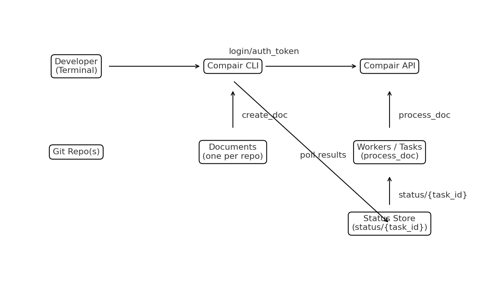

# Compair CLI

Compair CLI brings your **code-aware comparisons** to the terminal. Track repositories as documents, process recent changes, and surface relevant feedback across repo boundaries from your shell.

When you target Compair Cloud and notification scoring is enabled, the CLI can also use ranked notification events as a report-ordering and CI-gating layer.

**Highlights**
- Simple login (`/login`) and token storage
- Groups & membership (`/create_group`, `/load_groups`, `/load_group_users`, `/join_group`)
- Treat repos as documents (`/create_doc`)
- Process changes and fetch feedback (`/process_doc` + `/status/{task_id}`)
- Activity feed and notification events (Cloud)
- Notes on documents (`/documents/{document_id}/notes`)
- Continuous watch with notifications and command hooks



## Quickstart
```bash
# Build
go build -o compair .

# Fastest hands-on demo
./compair demo

# Auth
./compair login
./compair login browser
# or store a pre-issued token (CI/device/web flow)
./compair login --token "$COMPAIR_AUTH_TOKEN"
./compair whoami
./compair signup --email teammate@example.com --name "Teammate" --referral CODE123

# Switch API profiles (cloud/local/staging)
./compair profile ls
./compair profile use cloud

# Create/choose a group, set active group, then initialize inside your repo
./compair group create "Platform Services"
./compair group ls
./compair group use <group-id|group-name>
# With active group set, many commands omit the id:
./compair track

# Run a full review (uploads + pulls new feedback, waits up to 45s)
./compair review
# Upload only or fetch only when you want to stage work vs. pull feedback later
./compair sync --push-only
./compair sync --fetch-only
# Tune feedback wait window (seconds) if backend queues take longer
./compair sync --feedback-wait 90
# Or sync multiple repos / everything in active group
./compair sync ~/code/repo1 ~/code/repo2
./compair sync --all
# CI-friendly output/gating
./compair sync --json --gate api-contract

# Preview baseline snapshot payload (no upload)
./compair snapshot preview --output .compair/snapshot.md

# Inspect the payload that would be sent
./compair diff --snapshot-mode auto

# Summarize repo languages and snapshot coverage
./compair stats

# Watch for changes
./compair watch --interval 90s --notify --on-change 'echo "Commits:$COMPAIR_COMMITS Feedback:$COMPAIR_FEEDBACK_COUNT"'
# multi-repo watch
./compair watch --all

# Browse saved feedback report(s)
./compair reports
./compair reports --all
./compair reports --system
```

## Documentation Map

User-facing:
- [Cross-Repo Workflow](cross_repo_workflow.md)
- [User Guide](user_guide.md)
- [Core Quickstart](core_quickstart.md)
- [Hook Recipes](hook_recipes.md)
- [API Mapping](api_mapping.md)

Maintainer / operator-facing, but still safe to publish:
- [CI Review Examples](ci_review_examples.md)
- [Deployment Guide](deployment_guide.md)
- [Operator Guide](operator_guide.md)
- [CI & Release](ci_release.md)
- [Release Checklist](release_checklist.md)
- [Release Notes Template](release_notes_template.md)
