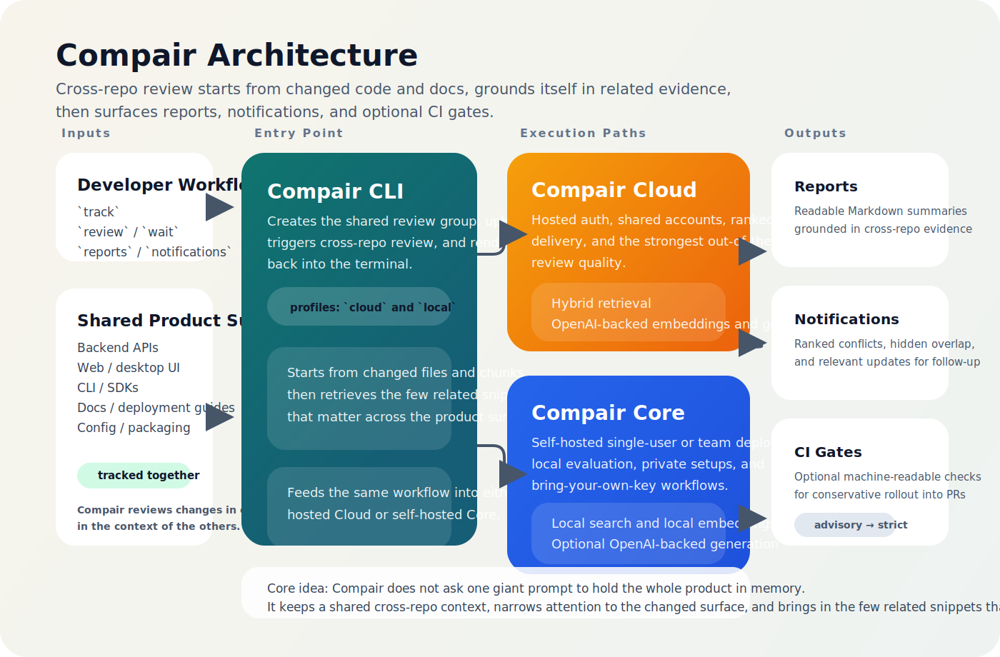

# Compair CLI Docs

Compair CLI brings semantic CI for docs/code drift to the terminal.
Use this docs hub to choose the fastest path: run the demo, inspect sample output, set up local Core, connect to Cloud, or move toward CI.

Most people should think in terms of `review`, `review --detach`, `wait`, `push`, and `pull`.
Treat `sync` as the advanced command surface for CI, JSON output, and power-user control.

Think of Compair as a context manager for teams: it keeps a shared cross-repo memory of your product surface, then focuses model attention on the changed area and the few related snippets that matter instead of relying on one giant prompt.



## Quick Start

```bash
compair demo --offline
```

For a real local Core review:

```bash
compair profile use local
compair core up
compair login
compair demo --mode local
```

For Cloud:

```bash
compair profile use cloud
compair signup --email you@example.com --name "Your Name"
compair login
compair demo --mode cloud
```

## Docs

### Start Here

- [User Guide](user_guide.md)
- [Sample Output](sample_output.md)
- [Cross-Repo Workflow](cross_repo_workflow.md)
- [Core Quickstart](core_quickstart.md)
- [CI Review Examples](ci_review_examples.md)

### Advanced / Operator Docs

- [Deployment Guide](deployment_guide.md)
- [Operator Guide](operator_guide.md)
- [API Mapping](api_mapping.md)
- [Hook Recipes](hook_recipes.md)
- [Config Reference](config_reference.md)

Internal launch, release, and packaging runbooks are maintained outside the
public docs set.
