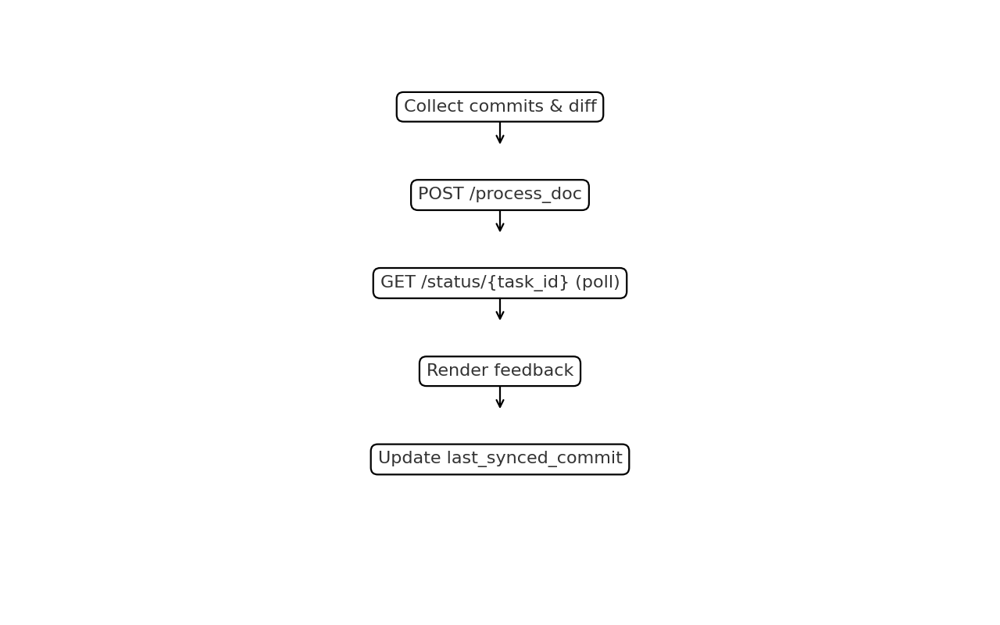

# User Guide

This guide walks through installing, authenticating, and using the Compair CLI.

Repository note: the binary and product name are `compair` / "Compair CLI". In this workspace, the repository directory is `compair-cli`.

Looking for the fastest first run? Start with `compair demo` in the README. Use this guide when you want the full command reference and workflow details.

## Install

| Platform | Recommended path | Notes |
| --- | --- | --- |
| macOS | Homebrew cask | Fastest install path today |
| Debian / Ubuntu | Compair APT repo | Falls back to GitHub Release `.deb` if preferred |
| Fedora / RHEL | Compair RPM repo | Falls back to GitHub Release `.rpm` if preferred |
| Windows | GitHub Release zip | WinGet is not broadly available until the upstream package PR merges |
| Any | Source build | Best for contributors and local hacking |

### Recommended on macOS

```bash
brew tap RocketResearch-Inc/tap
brew install --cask compair
```

### Recommended on Debian / Ubuntu

```bash
curl -fsSL https://rocketresearch-inc.github.io/compair-packages/install/debian.sh | bash
```

### Recommended on Fedora / RHEL

```bash
curl -fsSL https://rocketresearch-inc.github.io/compair-packages/install/compair.repo | sudo tee /etc/yum.repos.d/compair.repo >/dev/null
sudo dnf install -y compair
```

### Download a release

Start from the [GitHub Releases](https://github.com/RocketResearch-Inc/compair-cli/releases) page for macOS, Linux, and Windows archives.

### Install from source
```bash
# From source
go build -o compair .
mv compair /usr/local/bin/
```

## Quick demo
If you want the fastest end-to-end check, run:
```bash
compair demo
```

On an interactive terminal, Compair will ask whether to run:
- a local Core demo using the managed Docker runtime
- or a Cloud demo against the current hosted API/profile

The demo creates a disposable workspace with two small repos, tracks them in a dedicated demo group, and runs a real Compair review.

If you want the recommended multi-repo product workflow instead of the disposable demo, follow [cross_repo_workflow.md](cross_repo_workflow.md).

## Configure API base
The CLI uses `--api-base` or `COMPAIR_API_BASE`:
```bash
export COMPAIR_API_BASE="https://app.compair.sh/api"
```

## Login
Create an account if needed:
```bash
compair signup --email you@example.com --name "Your Name" --referral ABC123
```
Creates a new account by calling `/sign-up`. The password prompt hides your input, and `--referral` is optional.

Interactive login chooses the best method for the target server:
```bash
compair login
```

Behavior by server capabilities:
- Cloud with Google enabled: offers browser-based sign-in and waits for completion
- Password-based auth: prompts for email/password unless you pass them explicitly
- Single-user Core: auto-establishes a local session

Force browser-based sign-in explicitly:
```bash
compair login browser
```

Use email/password directly:
```bash
compair login --email you@example.com --password 'your-password'
```

Successful login stores a token at `~/.compair/credentials.json` and sends it in the `Authorization: Bearer` header (and `auth-token` for compatibility).

If you already have a valid token from web/device auth (or CI secret storage), you can save it directly:
```bash
compair login --token "$COMPAIR_AUTH_TOKEN" --user-id "<optional-user-id>" --username "<optional-username>"
```

If the server advertises single-user mode (`auth.required=false`), `compair login` skips credential prompts, establishes a session automatically, and lets you work without creating an account.

## Profiles & API endpoints
Profiles let you switch between Compair Cloud and self-hosted Core overlays without rebuilding the CLI.

```bash
compair profile ls
compair profile set staging --api-base https://staging.compair.local/api
compair profile use cloud
```

Resolution order for the API base: `--api-base` flag → `COMPAIR_API_BASE` → selected profile (or `COMPAIR_PROFILE`) → default profile (`cloud`). Switching profiles clears cached capability info so commands adapt immediately.

When you use the managed local Core runtime, `compair core up` automatically rewrites the `local` profile to match the configured localhost port.

```bash
compair status    # current auth, active group, repo binding, and snapshot defaults
compair doctor    # validate auth, group bindings, and current repo document health
compair doctor --json
compair version   # CLI + target server version/capability identity
compair telemetry status
compair telemetry on
compair telemetry off
compair feedback-length detailed
compair whoami    # prints username (and user_id)
compair logout    # removes stored credentials
```

## Anonymous CLI telemetry

The CLI now supports a small opt-in usage heartbeat:

```bash
compair telemetry status
compair telemetry on
compair telemetry off
```

When enabled, the CLI sends at most one anonymous heartbeat per day to `https://app.compair.sh/api` by default. The payload includes:

- a random local install ID
- CLI version
- OS and architecture
- the last command path that ran

It does **not** include repo contents, document text, auth tokens, usernames, or local file paths.

Override the collection endpoint when needed:

```bash
export COMPAIR_TELEMETRY_BASE="https://app.compair.sh/api"
```

Compair Cloud admins can inspect a summary with:

```bash
curl -H "admin-key: $ADMIN_API_KEY" \
  "https://app.compair.sh/api/admin/client_metrics_summary?days=30"
```

## Local Core runtime
Use this when you want to run `compair_core` locally without editing container environment variables by hand.

```bash
# Inspect the saved runtime config and Docker/container state
compair core status
compair core doctor

# Start the default single-user Core container with local providers
compair core up
compair profile use local
compair login

# Switch the local runtime to use your own OpenAI key
compair core config set --provider openai --openai-api-key "$OPENAI_API_KEY"
compair core up

# Run Core with local auth-enabled accounts instead of single-user mode
compair core config set --auth accounts
compair core up

# Return to the default free local path
compair core config set --provider local --auth single-user
compair core up

# Inspect or follow logs
compair core logs --tail 200
compair core logs --follow

# Recreate the container after changing saved config
compair core restart

# Shut the runtime down later
compair core down
compair core down --purge
```

Notes:
- `compair core up` runs the published `compairsteven/compair-core` container on the configured localhost port and updates the `local` CLI profile automatically.
- `--provider openai` sets both generation and embeddings to OpenAI.
- `--openai-code-model` and `--openai-notif-model` let you tune local Core review generation and notification scoring separately.
- `--openai-base-url` lets local Core talk to an OpenAI-compatible endpoint instead of the default OpenAI base URL.
- `--provider fallback` keeps local embeddings but disables model-generated feedback in favor of reference-only fallback behavior.
- If you prefer to source the key from the shell, set `COMPAIR_OPENAI_API_KEY` or `OPENAI_API_KEY` and omit `--openai-api-key`.
- `compair core doctor` validates Docker, the local profile, container state, the Core `/health` endpoint, and auth-mode alignment.

## Global options and active group
- `--api-base`, `--profile`, `--group`, `--verbose`, `--debug-http`, `--no-color`
- Active group resolution: `COMPAIR_ACTIVE_GROUP` → `--group` → `~/.compair/active_group`; if none is set, the CLI auto-selects a default (your `{username}` group if present, else the first group you belong to) and persists it.
```bash
compair group ls                # list groups (id + name); marks (active)
compair group use <group>       # set active group (id or name)
compair group current           # print active group
compair open                    # open the active/auto-resolved group in the web UI
```

`compair open` infers the UI origin from your API base by stripping a trailing `/api`. Override with `COMPAIR_UI_BASE` when needed.

Enable HTTP request logging (useful for support tickets):
```bash
compair --debug-http sync
```

## Groups
Create and inspect groups:
```bash
compair group create "Platform Services"
compair group ls
compair group list-users [group]
compair group join <group>
compair group rm <group>        # delete a group (admin only; prompts for confirmation)
```

With an active group set, you can omit the group (id or name) for many commands:
```bash
# Set the active group once
compair group use <group-id|group-name>

# Then you can:
compair group list-users           # uses active group if none provided
compair track                      # uses active group by default
```

Group resolution:
- Commands that accept a group allow either the group ID (e.g., `grp_123`) or the exact group name.
- If multiple groups have the same name, the CLI will list matching IDs and ask you to specify the ID.
- `group join <name>` also searches discoverable groups, not just groups you already belong to.
- Repo documents are published by default so other repos can reference them during cross-repo review. Use `--unpublished` to opt out.

## Initialize in a repo
Run inside a git repository:
```bash
compair track                     # simplest repo-first path; uses active group
compair track ./path/to/repo      # track another local repo
compair track --group <group>     # explicit group id or name
compair track --initial-sync      # register + send the first sync immediately
compair track --initial-sync --no-feedback   # register + upload a baseline without feedback
compair track --unpublished       # keep this repo private
```
- Creates a **document** representing the repo via `/create_doc`
- Saves `.compair/config.yaml` with `document_id` and repo metadata
- Existing repo bindings are auto-published on `compair sync` unless the repo config explicitly opts out with `unpublished: true`
- `compair track` is the repo-registration entry point
- `--no-feedback` only applies when paired with `--initial-sync`; it is the recommended way to baseline a repo into a shared group before a later warm review pass

## Self-feedback
For single-user cross-repo review, enable your own published repo documents as reference candidates:
```bash
compair self-feedback on
compair self-feedback off
```

Control how much generated feedback is returned for your account:
```bash
compair feedback-length brief
compair feedback-length detailed
compair feedback-length verbose
```

## Process changes
```bash
# Run a full review (default uploads + fetches, waits for processing,
# writes .compair/latest_feedback_sync.md, then renders it)
compair review --commits 10 --ext-detail
compair review --all --snapshot-mode snapshot --reanalyze-existing
compair review --detach   # submit now, then follow with `compair wait`
compair wait

# Simpler task-oriented aliases
compair push
compair pull
compair reports

# The lower-level sync flags still exist when you want them
compair sync --push-only
compair sync --fetch-only

# If your backend queues take longer, extend the wait window (seconds)
compair sync --feedback-wait 90

# If backend processing itself is the long pole, raise the per-document wait budget
compair review --process-timeout-sec 1200
compair review --process-timeout-sec 0

# Sync selected paths (resolved to repo roots)
compair sync ./projA ./projB

# Sync all tracked repos in the active group
compair sync --all --commits 10

# Preview payload without sending it
compair sync --dry-run

# CI-friendly summary output and gating
compair sync --json
compair sync --json --gate api-contract
compair sync --gate help
compair sync --json --fail-on-feedback 1   # count-based fallback when detailed notification gating is unavailable
```
- Collects recent commits + a summary of diffs since the last sync
- On the first sync of a repo (no `last_synced_commit` yet), sends a baseline snapshot with the file tree and full tracked text contents by default
- Sends text to `/process_doc` with `generate_feedback=true`
- `--reanalyze-existing` is the warm-pass switch: when paired with `--snapshot-mode snapshot`, Compair can generate feedback from already-indexed repo chunks that do not yet have feedback
- `compair review --detach` submits the review work and returns immediately; use `compair wait` to reattach later
- `compair wait` resumes saved pending repo tasks, then fetches and renders the resulting report
- `compair sync --feedback-wait` remains the lower-level knob when you want to cap only the post-processing feedback wait budget
- Large first baselines can also hit the per-document `--process-timeout-sec` wait budget; rerun the same command or use `compair wait` to continue waiting without resubmitting, or use `compair review --detach` / `compair push` and come back later
- Caches feedback IDs locally so repeated syncs only append newly seen items
- Updates `last_synced_commit` both in repo-local `.compair/config.yaml` and the workspace DB
- `--gate <preset>` provides the simplest path for common CI/review use cases without needing to remember low-level notification flags
- Built-in presets: `api-contract`, `cross-product`, `review`, `strict` (use `--gate help` to print details)
- `--fail-on-severity` and `--fail-on-type` use new notification events as the primary CI gate (severity + notification intent/type)
- `--fail-on-feedback` remains the simpler fallback gate when detailed notification data is unavailable or unsupported
- Saved reports are ordered using ranked notification events when they are available, so higher-severity/higher-certainty items appear first with notification rationale attached on both Cloud and Core
- Core still differs from Cloud on delivery/integration layers such as Google OAuth, billing, and hosted notification delivery
- Long-running review commands now print periodic progress lines while waiting for server-side processing and while waiting for newly generated feedback; the ETA is approximate

Baseline snapshots now default to full-repo indexing. Add caps only when you want a lighter or faster run:
```bash
compair sync --snapshot-max-files 80 --snapshot-max-total-bytes 500000
compair push --snapshot-max-total-bytes 300000 --snapshot-max-files 60
```

What tends to produce the strongest cross-repo signal:

- focused edits beat large mixed rewrites
- one concrete route/field/config change is easier to ground than several unrelated changes in the same chunk
- docs, API maps, and config tables are easiest to compare when the changed rows stay close to the implementation or companion docs they affect

What tends to be harder:

- tiny structured renames buried inside a much larger rewritten chunk
- many unrelated edits in the same file during snapshot review
- broad prose rewrites where the old and new behavior are both only implied

This is one reason smaller, more coherent diffs usually work better with Compair, in addition to being good general git hygiene.

## First-time multi-repo review
For a shared group of repos you own, the recommended pattern is:

```bash
# 1. Put every repo in the same active group and upload a baseline with no feedback
compair group use <group-id|group-name>
compair self-feedback on
compair track ~/code/compair_core --initial-sync --no-feedback
compair track ~/code/compair_cloud --initial-sync --no-feedback
compair track ~/code/compair-cli --initial-sync --no-feedback

# 2. Once all repo baselines exist in that group, run one warm snapshot pass
compair review --all --snapshot-mode snapshot --reanalyze-existing
```

This keeps the onboarding path aligned with the normal Compair model:
- each repo is still just a document in a group
- the baseline pass creates the searchable snapshot without prematurely generating feedback
- the warm pass generates feedback after the whole group is available for cross-repo reference selection

Persist those caps in a profile when you want them every time:
```bash
compair profile set cloud --snapshot-max-files 80 --snapshot-max-total-bytes 500000
```

Force snapshot or diff mode (default: auto):
```bash
compair sync --snapshot-mode snapshot
compair sync --snapshot-mode diff
```

Include/exclude files in snapshots:
```bash
compair sync --snapshot-include "src/*.py" --snapshot-exclude "vendor/*"
```

Preview a baseline snapshot (no upload):
```bash
compair snapshot preview --output .compair/snapshot.md
```

See the exact payload that would be sent:
```bash
compair diff --snapshot-mode auto
```

Summarize language mix and snapshot coverage:
```bash
compair stats
```

When OCR uploads are disabled on the server, the CLI continues syncing but warns that OCR-based extraction is unavailable. Configure `COMPAIR_OCR_ENDPOINT` to point at your own OCR service or upgrade to Compair Cloud for full OCR support.



## Review feedback reports
```bash
# Show the latest report using the built-in renderer
compair reports

# Step through every saved report
compair reports --all

# Open the latest report using your OS default markdown viewer
compair reports --system

# Render a specific file
compair reports --file .compair/latest_feedback_sync.md
```
- Reports saved under `.compair/*.md` are discoverable via `compair reports`
- Rendering happens in-terminal via a lightweight Markdown renderer with a plain-text fallback
- When iterating (`--all`), press Enter to move forward, `o` to open the file externally, or `q` to exit
- On Cloud, report sections are ordered using notification-event ranking when those events exist for the feedback chunks

## Activity feed
```bash
# See recent activity across your groups (Cloud only)
compair activity
compair activity --include-own=false --page 1 --page-size 20
```

## Notifications
```bash
# List ranked notification events
compair notifications
compair notifications --include-ack --include-dismiss --all-groups

# Act on a notification event
compair notifications ack <event_id>
compair notifications dismiss <event_id>
compair notifications share <event_id> --note "Please review"

# Show or update hosted delivery preferences
compair notifications prefs
compair notifications prefs --digest on --frequency daily
compair notifications prefs --push on --max-push 1
compair notifications prefs --all-buckets --clear-quiet-hours
compair notifications prefs --delivery-email alerts@example.com
compair notifications prefs --clear-delivery-email
```

Notes:
- Ranked notification events work on both Cloud and Core when the server advertises `features.notification_events=true`.
- Hosted email delivery remains a Cloud capability. The `prefs` subcommand controls Cloud digests and instant email alerts; on pure Core those settings are mostly informational.
- Hosted delivery now defaults to explicit opt-in. Digests are off until enabled, and the default cadence when enabled is `daily`.
- Alternate delivery emails must be verified before Compair will route push/digest mail there. Until verification completes, the current verified address stays active.

## Feedback controls
```bash
compair feedback rate <feedback_id> --value positive
compair feedback rate <feedback_id> --value negative
compair feedback rate <feedback_id> --value clear
compair feedback hide <feedback_id>
compair feedback hide <feedback_id> --unhide
```

## Notes
```bash
compair notes list <document_id>
compair notes add <document_id> --content "Review notes here"
compair notes add <document_id> --file ./notes.txt
compair notes get <note_id>
```

## List documents
```bash
# List documents for the active group
compair docs list

# Filters
compair docs list --filter recently_updated
compair docs list --filter recently_compaired
compair docs list --filter unpublished --own-only
```

## Watch & notify
```bash
# Watch current repo
compair watch --interval 90s --notify --on-change 'open .compair/last-sync.md'

# Watch specific repos by path
compair watch ~/code/repo1 ~/code/repo2

# Watch all tracked repos for the active group
compair watch --all
```
- Repeats sync on an interval
- Watches your local checkout state; it does not subscribe to remote collaborator pushes by itself
- Remote collaborator changes surface after they land in your local repo or when another client/server process syncs them into Compair
- Best-effort notifications on macOS/Linux/Windows
- Hook (`--on-change`) runs a shell command on changes

**Hook environment:**
- `COMPAIR_COMMITS` – number of commits detected in last cycle
- `COMPAIR_FEEDBACK_COUNT` – number of feedback items
- `COMPAIR_SYNC_JSON` – path to a JSON file with the full result (if available)

See [Hook Recipes](hook_recipes.md) for ideas.

## Track files, directories, and repos (workspace DB)
The CLI maintains a canonical index at `~/.compair/workspace.db` to map local paths ↔ groups ↔ documents.
```bash
# Add items to the active group
compair add ./src ./README.md

# Remove items from tracking
compair rm ./README.md

# Show tracked items under the current directory
compair status
```

### Quick shell helper
Add a helper function to your shell profile to switch the active group quickly:

```bash
compair_use() {
  export COMPAIR_ACTIVE_GROUP="$1"
  echo "Active group: $COMPAIR_ACTIVE_GROUP"
}
```

*(Fish or PowerShell users can adapt the snippet above to their shell syntax.)*

Notes:
- For now, `sync` and `watch` operate on repo-local `.compair/config.yaml`.
- The workspace DB is the source of truth for `add`, `rm`, and `status`.
- Command names use a single style: `group ...` subcommands (colon forms are deprecated).
